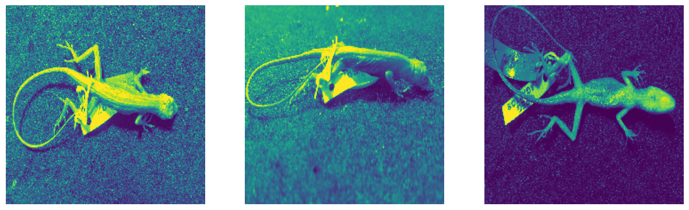
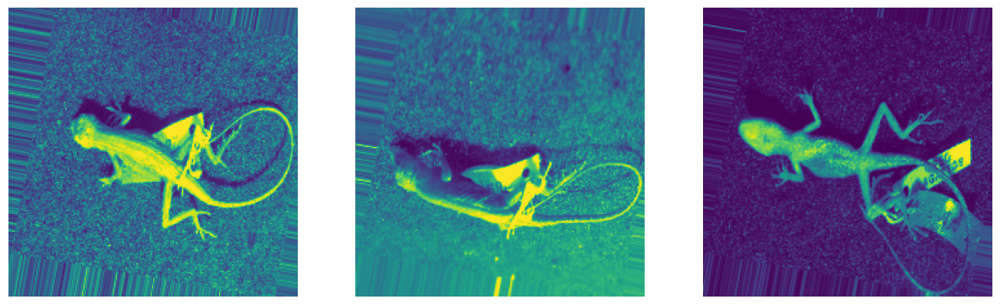
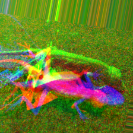

# 3D Amazonian Lizards Representations Hybrid Classifier

In this project we built a hybrid classifier for amazonian lizards 3D representations using a customized pre-trained MobileNetV3 Small model as the feature extractor, and a LinearSVC scikit-learn model as the classifier. This project was developed based on an academic research with a non-public dataset of images collected at the Museu Paraense Emílio Goeldi, a brazilian research institute and museum, located in the city of Belém, state of Pará, Brazil.

The institutes involved in this research are: the University of Amazonia, the Federal University of Pará, and the Museu Paraense Emílio Goeldi.

## Table of Contents

- [Project Overview](#project-overview)
- [Installation](#installation)
- [Usage](#usage)
- [Example](#example)
- [Contributing](#contributing)
- [License](#license)

## Project Overview

In this project I built a hybrid classifier for amazonian lizards 3D representations. The hybrid model is comprised of a customized pre-trained MobileNetV3 Small, a model very suitable for mobile devices, what could definitely benefit a classifier for specimens captured within the rainforest, and also trained on the famous ImageNet competition, reaching pretty good results.

Different models either for feature extraction and classification were compared in this study, using raw feature sets directly extracted from the neural networks' feature maps, as well as ranked features computed using a Random Forest model.

The three-dimensional representations used for training our models are comprised of 3 images, one dorsal, another one lateral and another one ventral, from the specimens. This allowed our models to learn a more complete and diverse set of patterns for each specie.

<div align="center">
  
</div>

The image shown above demonstrates how each channel of our samples is, separately.

We worked with a total of three species, namely: a) Anolis fuscoauratus; b) Hoplocercus spinosus; and c) Polychrus marmoratus. Our original dataset had a limited amount of 3D samples per specie, so we needed to generate new samples using a data augmentation technique. The approach we choose to augmente our dataset was to apply the TensorFlow's `ImageDataGenerator()` object to our 3D samples and then create variations on the 3 channels to help our model to better generalize each specie. This way we jumped from a few tens to hundreds and even thousands (for some of the species) of samples.

<div align="center">
  
</div>

The image shown above demonstrates an augmented version of the image shown previously.

The parameters passed to the `ImageDataGenerator()` object in order to generate our new samples are described below:
```python
{
    "rotation_range": 20,
    "width_shift_range": 0.2,
    "height_shift_range": 0.2,
    "shear_range": 0.2,
    "zoom_range": 0.2,
    "horizontal_flip": True,
    "vertical_flip": True,
    "fill_mode": "nearest"
}
```

After the data augmentation process, we then put together each channel to built our 3D representations dataset, where each sample has visual features from each side of a specimen. The image shown below demonstrates how a 3D sample looks like to our models, where each side of the lizard is represented by a color channel.

<div align="center">
  
</div>

From this point we applied the computer vision models to extract features from our 3D samples and then performed dimensionality reduction (in some cases), and then fitted our classification models. Our best model reached an accuracy of 95.53% and a F1-Score of 94.83% on our validation set. You can check more information on our notebooks.

## Installation

1. Start by cloning the repository:

   ```bash
   git clone https://github.com/v4ryag/amazonian-lizards-hybrid-classifier.git
   ```

2. Change into the project directory:

   ```bash
   cd amazonian-lizards-hybrid-classifier
   ```

3. Set up a virtual environment (optional but recommended):

   ```bash
   python3 -m venv venv
   source venv/bin/activate
   ```

4. Install the required dependencies:

   ```bash
   pip install -r requirements.txt
   ```

## Usage

The usage of our model is centered on BentoML, a python framework for standardized model packaging and serving, extensively used by giants of the tech industry, with easy deployment and integration with Kubernetes and other monitoring technologies.

To use our hybrid model right off the bat, after downloading and setting up your development environment, run:

```bash
bentoml serve service:svc --production
```

And then a scalable inference API will be accessible in your browser on the port 3000 (by default).

<div align="center">
  
</div>

To build the model package, execute the following inside the project directory:

```bash
bentoml build
```

## Contributing

There is not a right way to contribute to this project, once our dataset of 3D samples is not public, but you can definitely use this project as an inspiration and as a basis to applications involving other datasets of 3D samples, like plants, animals and anything similar. 

As a tip, a great way to expand/improve this project would be by collecting more samples, once we had access to a limited amount of samples per specie. With more data, we could easily increase our model's generalization capacity, making it to work even without a machine learning classifier, and using only the neural network only, by retraining it from scratch!

## License

This project is licensed under the [MIT License](LICENSE).